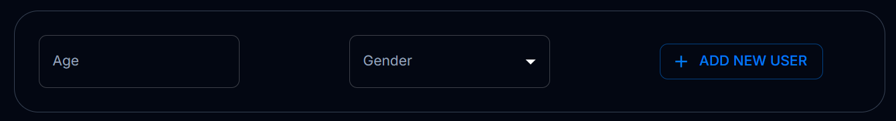
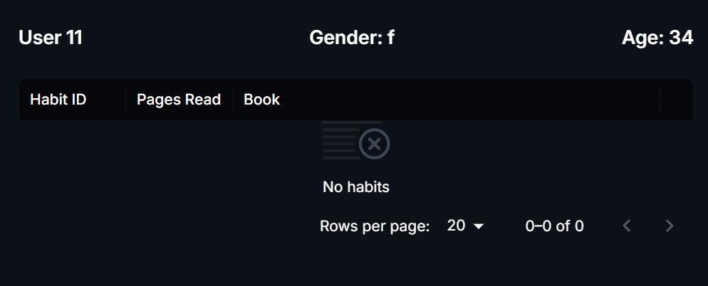
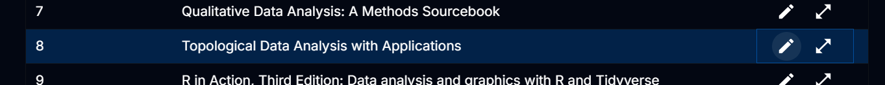
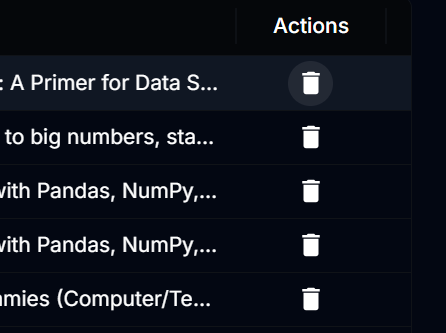
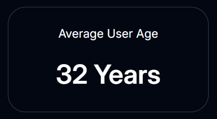
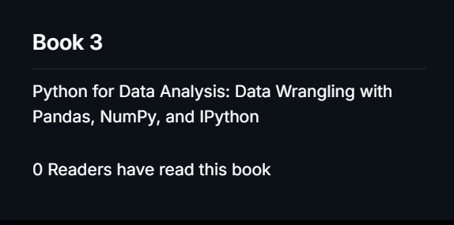
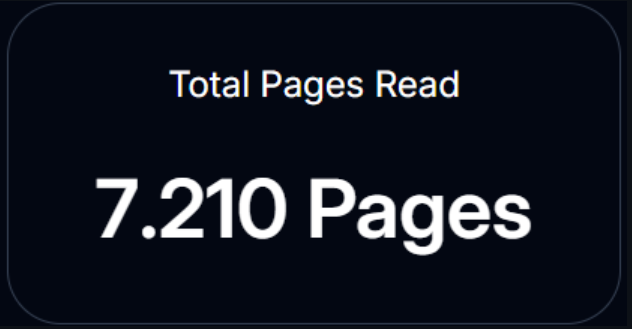
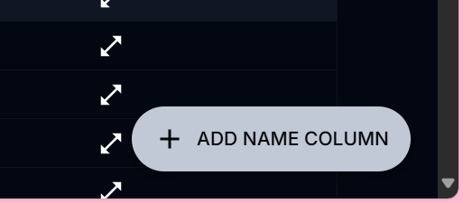
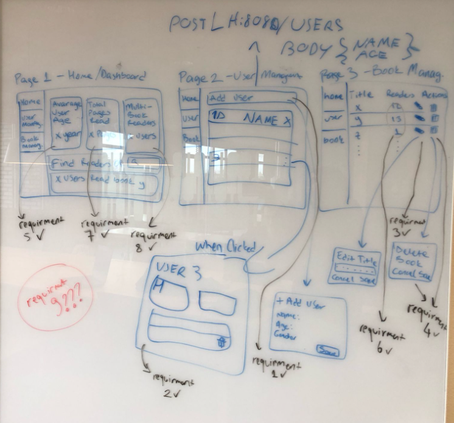

# SE_A2_SERVICE
Backend & Frontend Project for Reading Habits Tracking Assignment 2

## 🤖 Features
1. Provide the ability to add a user to the database
2. Provide all the reading habit data for a certain user
3. Provide the ability to change the title of a book in the database
4. Provide the ability to delete a record/row from the ReadingHabit table
5. Provide the mean age of the users
6. Provide the total number of users that have read pages from a specific book
7. Provide the total number of pages read by all users
8. Provide the total number of users that have read more than one book
9. Add a column to the User table named "Name" which contains TEXT data

## 🚀 Getting Started
### Backend Setup (Spring Boot)
1. **Sync the project** by right-clicking on `pom.xml` (if using an IDE like IntelliJ/Eclipse)
2. **Ensure you have:**
    - Java 17+
    - Maven 3.8+
3. **Run the application:**
   ```bash
   mvn spring-boot:run
The backend will start at http://localhost:8080.

### 👩‍🎨 Frontend Setup (React)
Install dependencies:
'''bash
npm install
'''

Start the development server:
''' bash
npm run dev
'''

Access the app at http://localhost:5173.

## ✅ Feature Coverage 
Requirement	Description	Location
## 1	Add a user to the database	(in UserController) 

createUser()
"insert into user (age, gender) values (?, ?)";

## 2	Fetch all reading habits for a user	(in UserController)

getUserHabit()
SELECT * FROM reading_habit r LEFT JOIN book b ON r.bookid = b.bookid LEFT JOIN user u ON r.userid = u.userid where u.userID = %d ",userID

## 3	Update a book’s title  (in BookController)



updateBook()
"UPDATE book SET book_name= ? WHERE bookid= ?"

## 4	Delete a record from ReadingHabit	(in ReadingHabitController) 

deleteHabit()
"DELETE FROM reading_habit WHERE habitID= %d", habitID

## 5	Calculate mean age of users	(in UserController)

getUsersMean()
String query = "SELECT AVG(age) FROM user"

## 6	Count users who read a specific book (in BookController)

getBookReaderCount()
"select count(case bookid when %d then 1 else null end) as ReaderCount\n from reading_habit", bookID

## 7	Total pages read by all users ( in ReadingHabitController)

getTotalReadPages()
String query = "SELECT SUM(pages_read) FROM reading_habit";

## 8	Count users who read >1 book	( in UserController)

getMultiReaders() {
String sql = "Select sum(count) from (select userid, count(DISTINCT userid) as Count from reading_habit group by userid having count(userid) >= 2);";

## 9	Added Name (TEXT) column to User table	Database migration file or entity class (in UserController)

switchName()
"ALTER TABLE user ADD name varchar(255);"

## 📂 Project Structure
Backend: Spring Boot (Java)

Controllers: UserController, ReadingHabitController

Models: User, ReadingHabit

Repository: 

Frontend: React 

Components: Organized by feature (UserForm, HabitList)

## 🔧 Troubleshooting
Dependency issues: Run mvn clean install (backend) or npm install --force (frontend).

CORS errors: Ensure backend allows requests from http://localhost:5173.

## 📝 Notes
This project was developed for SE Assignment 2

## ✅ Extra
A low fidelity picture of our design steps;
  


